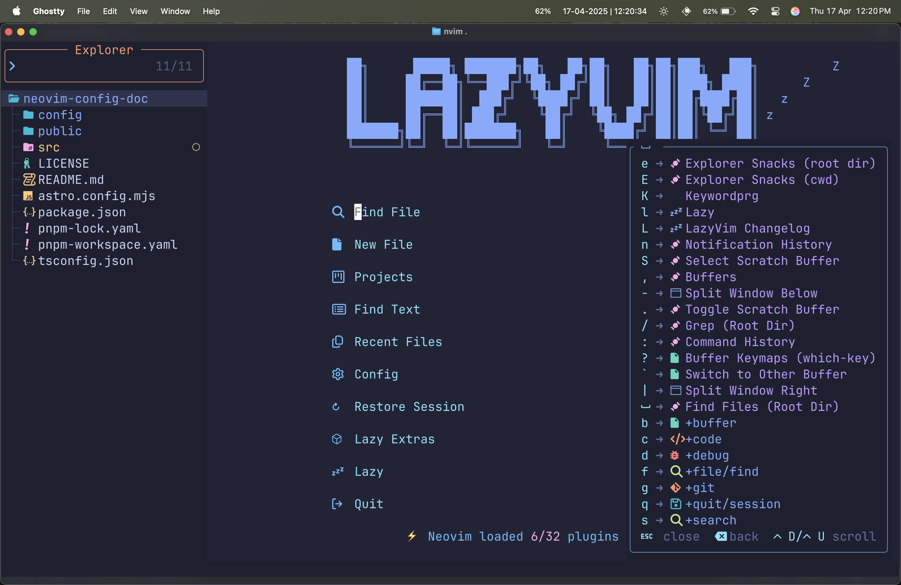

This guide focuses on Neovim-specific features, plugin usage, and configuration best practices. For basic Vim commands and navigation, please refer to the [Vim Cheatsheet](/vim/cheatsheet).

We have converted most of the key-bindings that are compatible with Neovim in the [Vim Cheatsheet](/vim/cheatsheet).

## General Keybindings



Modes:

- Normal (n)
- Insert (i)
- Visual (v)
- Command (c)
- Terminal (t)

```
 A - Alt
 C - Control
 S - Shift
 <leader> - Space (default)
```

> In most modern editors like VS Code, a "tab" represents an open file. In Vim/Neovim, this concept is called a "buffer" - which is an in-memory representation of a file. When we refer to Buffer(Tab) in the keybindings below, we mean switching between open files, similar to switching tabs in other editors.

**Quick Definitions:**

- **Buffer**: A buffer is the in-memory text of a file being edited. Multiple buffers can exist for different files.
- **Tab**: In Vim, a tab is actually a collection of windows arranged in a specific layout. This is different from the "tabs" concept in modern editors.

| Key                              | Description                                     | Mode       |
| -------------------------------- | ----------------------------------------------- | ---------- |
| j                                | Down                                            | n, v       |
| `<Down>`                         | Down                                            | n, v       |
| k                                | Up                                              | n, v       |
| `<Up>`                           | Up                                              | n, v       |
| `<C-h>`                          | Go to Left Window                               | n          |
| `<C-j>`                          | Go to Lower Window                              | n          |
| `<C-k>`                          | Go to Upper Window                              | n          |
| `<C-l>`                          | Go to Right Window                              | n          |
| `<C-Up>`                         | Increase Window Height                          | n          |
| `<C-Down>`                       | Decrease Window Height                          | n          |
| `<C-Left>` (Mac: `<C-A-Left>`)   | Decrease Window Width                           | n          |
| `<C-Right>` (Mac: `<C-A-Right>`) | Increase Window Width                           | n          |
| `<A-k>`                          | Move Line Up                                    | n, i, v    |
| `<A-j>`                          | Move Line Down                                  | n, i, v    |
| `<S-h>`                          | Go to Prev Buffer (Tab)                         | n          |
| `<S-l>`                          | Go to Next Buffer (Tab)                         | n          |
| `[b`                             | Go to Prev Buffer                               | n          |
| `]b`                             | Go to Next Buffer                               | n          |
| `<leader>bb`                     | Switch to Other Buffer (Tab)                    | n          |
| `<leader>bd`                     | Delete Buffer (Close tab)                       | n          |
| `<leader>bo`                     | Delete Other Buffers (Close other tabs)         | n          |
| `<leader>bD`                     | Delete Buffer and Window (Close tab and window) | n          |
| `<esc>`                          | Escape and Clear hlsearch                       | i, n, s    |
| `<leader>ur`                     | Redraw / Clear hlsearch / Diff Update           | n          |
| n                                | Next Search Result                              | n, v, o    |
| N                                | Prev Search Result                              | n, v, o    |
| `<C-s>`                          | Save File                                       | i, v, n, s |
| `<leader>K`                      | Keywordprg                                      | n          |
| gco                              | Add Comment Below                               | n          |
| gcO                              | Add Comment Above                               | n          |
| `<leader>l`                      | Lazy                                            | n          |
| `<leader>fn`                     | New File                                        | n          |
| `<leader>xl`                     | Location List                                   | n          |
| `<leader>xq`                     | Quickfix List                                   | n          |
| `[q`                             | Previous Quickfix                               | n          |
| `]q`                             | Next Quickfix                                   | n          |
| `<leader>cf`                     | Format                                          | n, v       |
| `<leader>cd`                     | Line Diagnostics                                | n          |
| `]d`                             | Next Diagnostic                                 | n          |
| `[d`                             | Prev Diagnostic                                 | n          |
| `]e`                             | Next Error                                      | n          |
| `[e`                             | Prev Error                                      | n          |
| `]w`                             | Next Warning                                    | n          |
| `[w`                             | Prev Warning                                    | n          |
| `<leader>uf`                     | Toggle Auto Format (Global)                     | n          |
| `<leader>uF`                     | Toggle Auto Format (Buffer)                     | n          |
| `<leader>us`                     | Toggle Spelling                                 | n          |
| `<leader>uw`                     | Toggle Wrap                                     | n          |
| `<leader>uL`                     | Toggle Relative Number                          | n          |
| `<leader>ud`                     | Toggle Diagnostics                              | n          |
| `<leader>ul`                     | Toggle Line Numbers                             | n          |
| `<leader>uc`                     | Toggle Conceal Level                            | n          |
| `<leader>uA`                     | Toggle Tabline                                  | n          |
| `<leader>uT`                     | Toggle Treesitter Highlight                     | n          |
| `<leader>ub`                     | Toggle Dark Background                          | n          |
| `<leader>uD`                     | Toggle Dimming                                  | n          |
| `<leader>ua`                     | Toggle Animations                               | n          |
| `<leader>ug`                     | Toggle Indent Guides                            | n          |
| `<leader>uS`                     | Toggle Smooth Scroll                            | n          |
| `<leader>dpp`                    | Toggle Profiler                                 | n          |
| `<leader>dph`                    | Toggle Profiler Highlights                      | n          |
| `<leader>uh`                     | Toggle Inlay Hints                              | n          |
| `<leader>gb`                     | Git Blame Line                                  | n          |
| `<leader>gB`                     | Git Browse (open)                               | n, v       |
| `<leader>gY`                     | Git Browse (copy)                               | n, v       |
| `<leader>qq`                     | Quit All                                        | n          |
| `<leader>ui`                     | Inspect Pos                                     | n          |
| `<leader>uI`                     | Inspect Tree                                    | n          |
| `<leader>L`                      | LazyVim Changelog                               | n          |
| `<leader>fT`                     | Terminal (cwd)                                  | n          |
| `<leader>ft`                     | Terminal (Root Dir)                             | n          |
| `<c-/>`                          | Terminal (Root Dir)                             | n          |
| `<c-_>`                          | which_key_ignore                                | n, t       |
| `<C-/>`                          | Hide Terminal                                   | t          |
| `<leader>-`                      | Split Window Below                              | n          |
| `<leader>\|`                     | Split Window Right                              | n          |
| `<leader>wd`                     | Delete Window                                   | n          |
| `<leader>wm`                     | Toggle Zoom Mode                                | n          |
| `<leader>uZ`                     | Toggle Zoom Mode                                | n          |
| `<leader>uz`                     | Toggle Zen Mode                                 | n          |
| `<leader><tab>l`                 | Last Tab                                        | n          |
| `<leader><tab>o`                 | Close Other Tabs                                | n          |
| `<leader><tab>f`                 | First Tab                                       | n          |
| `<leader><tab><tab>`             | New Tab                                         | n          |
| `<leader><tab>]`                 | Next Tab                                        | n          |
| `<leader><tab>d`                 | Close Tab                                       | n          |
| `<leader><tab>[`                 | Previous Tab                                    | n          |
